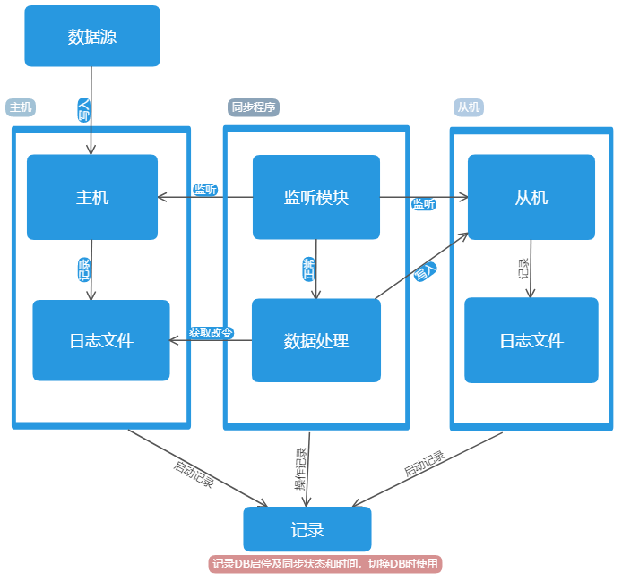

# influxdb_sync
> InfluxDB主从同步脚本

### 介绍

该项目实现了InfluxDB的主从同步。

主从同步结构参考了[MySQL主从同步的实现](https://blog.csdn.net/linuxlsq/article/details/52606292)，进行了部分简化。使用InfluxDB内部日志记录增删改查数据，使用Python脚本将日志过滤后，增删改记录同步到从库中。

> 拓扑图

**实现单边主从同步，只需要在主机侧启动该项目脚本。该项目需要结合修改过后的[InfluxDB](https://github.com/callELPSYCONGROO/influxdb)使用。**

### 启动运行

* 下载该项目，实际上需要的文件为：
    * /ms/**
    * /main.py
    
* 安装或更新Influxdb-python插件模块，使用脚本 `pip install influxdb` 或 `pip install --upgrade influxdb`

* 配置脚本：

    * 打开配置文件 ms/config.py
    
    * 修改以下配置为你的配置
        * 主机日志文件路径 INFLUXDB_MASTER_LOG，这个文件是Influxdb配置文件中配置的记录http请求的日志文件（access-log-path对应的那个文件）
        
        * 从机HOST INFLUXDB_SLAVE_HOST
        
        * 从机PORT INFLUXDB_SLAVE_PORT
        
        * 从机用户名 INFLUXDB_SLAVE_USER
        
        * 从机密码 INFLUXDB_SLAVE_PASSWORD
        
        * 如果想要打印脚本运行的消息，将MODEL值置为 `test` 即可
        
        * 其他配置可以不修改

* 运行，使用脚本 `python main.py`
